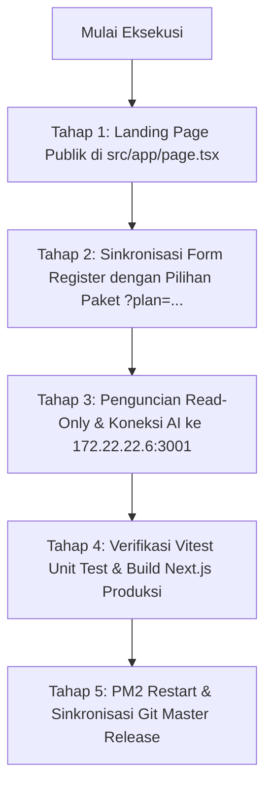

# CETAK BIRU IMPLEMENTASI: LANDING PAGE KASTOKO & INTEGRASI CHAT AI (READ-ONLY)

Dokumen ini adalah acuan arsitektur dan tahapan eksekusi untuk pembangunan Landing Page Publik KasToko serta integrasi asisten AI ke server AI mandiri (`172.22.22.6`).

---

## 1. Arsitektur Server & Infrastruktur AI Terpisah

Berdasarkan hasil inspeksi read-only pada server AI lokal:
- **Server AI Fisik Mandiri**: IP `172.22.22.6` (Debian 6.12 AMD64, RAM 7.8 GB dengan sisa 5.0 GB Free).
- **Alasan Pemisahan Beban**: Komputasi LLM dan token processing dijalankan di `172.22.22.6` sehingga server POS kasir KasToko (`172.22.22.18`) tetap dingin, ringan, dan tidak terbebani lag transaksi.
- **Komponen Layanan AI Aktif di `172.22.22.6`**:
  1. **FreeLLM API Gateway** (Port `3001`):
     - Endpoint OpenAI-Compatible: `http://172.22.22.6:3001/v1/chat/completions`
     - Unified API Key: `freellmapi-05e7421e181b72e15c9ec7c61beb0eaaf60e5bcef425fd44`
     - Model Utama: `openai/gpt-oss-120b` (Groq Backend, teruji responsif & super cepat) dan `gemini-2.5-flash` (Google Backend).
  2. **Hermes Workspace Web UI** (Port `3002`):
     - Dashboard manajemen agent Hermes (`http://172.22.22.6:3002`).
  3. **Hermes Agent CLI Daemon** (Port `8642`):
     - Daemon engine Hermes v0.21.0 di `/opt/hermes-agent/venv`.
  4. **WhatsApp Multi-Device Gateway** (Port `3000`):
     - REST API pengiriman notifikasi/struk WA (`go-whatsapp-web-multidevice`).

---

## 2. Aturan Keamanan Mutlak: Chat AI Wajib 100% Read-Only

Untuk menjaga integritas keuangan dan data toko UMKM penyewa:
1. **Pencabutan Wewenang Mutasi Langsung**:
   - Di file `src/app/api/ai/chat/route.ts`, wewenang AI untuk mengeksekusi aksi mutasi (`create_expense` / `catat_pengeluaran_toko`) dicabut sepenuhnya dari eksekusi otomatis.
   - AI **DILARANG KERAS** mengeksekusi operasi `INSERT`, `UPDATE`, `DELETE`, atau memotong kas toko.
2. **Tool yang Diizinkan (Kueri Analitik Read-Only / SELECT)**:
   - `get_daily_sales` / `ambil_penjualan_harian`: Analisis total omset, estimasi laba kotor, dan total transaksi hari berjalan.
   - `get_low_stock_products` / `ambil_produk_menipis`: Menampilkan daftar barang yang stoknya di bawah batas minimum (`stockQty <= minStock`).
   - `get_debtor_list` / `ambil_daftar_kasbon`: Menampilkan daftar pelanggan yang masih memiliki piutang kasbon belum lunas (hanya bisa diakses oleh akun *Owner*).
   - Analisis tren belanja kasir umum.
3. **Mekanisme Human-in-the-Loop (Persetujuan Manusia)**:
   - Jika pengguna meminta: *"Catat beli galon Rp 20.000"*, AI **TIDAK** langsung mencatat ke database.
   - AI hanya merespon dengan menyiapkan **Kartu Draf Pengeluaran** di tampilan chat dengan tombol interaktif `[Konfirmasi Catat Pengeluaran]`.
   - Transaksi pemotongan kas hanya terjadi setelah pemilik/kasir toko mengklik tombol tersebut secara sadar.

---

## 3. Struktur & Urutan Landing Page Publik (`src/app/page.tsx`)

Landing page dirancang modern, berkelas, bernuansa ritel modern (Emerald/Slate), dan persuasif untuk pemilik toko/warung:

### A. Top Navigation Bar (Header Sticky)
- **Brand**: Logo KasToko + Badge *"SaaS POS Ritel & Warung"*.
- **Menu Navigasi**: Fitur Unggulan, Perangkat Kasir, Paket Harga, FAQ.
- **Aksi Cepat**:
  - Tombol Masuk: `Masuk ke Toko` -> `/login`
  - Tombol Aksi Utama: `Mulai Uji Coba Gratis` -> `/register?plan=trial`

### B. Hero Section (Pukulan Pertama)
- **Headline**: *"Bikin Warung & Toko Anda Naik Kelas: Kasir Cepat, Stok Rapi, dan Laba Tercatat Otomatis."*
- **Subheadline**: *"Aplikasi kasir ritel modern berbasis cloud dengan mode 100% offline-first. Transaksi tetap jalan meski mati lampu atau internet padam."*
- **Dual Call-to-Action (CTA)**:
  1. 🟢 **Tombol Primer**: `Coba Gratis 7 Hari (Tanpa Kartu Kredit)` -> `/register?plan=trial`
  2. ⚪ **Tombol Sekunder**: `Uji Coba Akun Demo Langsung` -> 1-klik login demo (`budi@tokoberkah.id`)
- **Visual Mockup Interaktif**: Ilustrasi antarmuka kasir KasToko pada tablet/layar POS + mini thermal printer Bluetooth + struk kasir keluar rapi.

### C. Value Strip (4 Pilar Keunggulan Ritel)
- ⚡ **100% Offline-First**: Kasir tetap bisa scan barcode & cetak struk tanpa internet. Otomatis sinkronisasi saat online.
- 🖨️ **Bebas Pilih Printer**: Kompatibel printer thermal Bluetooth 58mm/80mm, printer USB, dan kasir laci uang.
- 💳 **QRIS Dinamis & Stiker Toko**: Terima pembayaran QRIS langsung tanpa repot hitung uang kembalian.
- 🔒 **Data Toko Terisolasi Aman**: Sistem PostgreSQL Row Level Security (RLS) menjamin data dagangan toko tidak akan tertukar atau bocor.

### D. Showcase Fitur Unggulan Toko
1. **Mesin Kasir Kilat & Barcode Scanner**: Dukungan barcode scanner USB/Bluetooth & kamera HP, transaksi selesai dalam 3 detik.
2. **Buku Kasbon Digital & Tagihan WhatsApp**: Catat kasbon pelanggan langganan dan kirim rincian tagihan via WhatsApp dalam 1-klik.
3. **Sistem Peringatan Stok Menipis**: Notifikasi dini sebelum barang dagangan terlaris habis di rak toko.
4. **Asisten AI Analis Bisnis (Read-Only)**: Konsultasi omset, laba harian, dan barang paling laris langsung lewat obrolan teks ramah yang 100% aman.

### E. Tabel Paket & Tarif Langganan (Pricing Section)
Mengambil data tarif resmi dari modul Super Admin:
1. **Paket Uji Coba (Trial)**:
   - Harga: **Rp 0** (Gratis 7 Hari Penuh)
   - Fitur: Kasir POS lengkap, cetak struk Bluetooth, barcode scanner, kelola stok 50 item.
   - Tombol: `Daftar Trial Sekarang` -> `/register?plan=trial`
2. **Paket Bulanan (Usaha Aktif)**:
   - Harga: **Rp 50.000** / bulan
   - Fitur: Semua fitur POS tanpa batas, kasbon WA, produk unlimited, backup cloud harian.
   - Tombol: `Pilih Paket Bulanan` -> `/register?plan=monthly`
3. **Paket Tahunan (Best Value 🔥 - Hemat Sewa)**:
   - Harga: **Rp 550.000** / tahun *(Diskon 1 bulan sewa gratis!)*
   - Fitur: Prioritas dukungan teknis, fitur multi-kasir, analitik laporan laba rugi lengkap.
   - Tombol: `Ambil Promo 1 Tahun` -> `/register?plan=yearly`

### F. Alur Registrasi & Aktivasi Instan
- Tautan pendaftaran membaca parameter URL `?plan=trial|monthly|yearly`.
- Pendaftar yang memilih **Trial** langsung diarahkan ke form pembuatan toko baru dan masa aktif 7 hari otomatis aktif.
- Pendaftar yang memilih **Bulanan / Tahunan** langsung diarahkan ke form pendaftaran sekaligus menampilkan QRIS/rekening pembayaran Super Admin untuk verifikasi aktivasi.

### G. FAQ & Footer
- Tanya jawab seputar printer kasir, kompatibilitas HP/komputer, keamanan data, dan migrasi dari buku manual.
- Footer: Copyright, tautan privasi, status server, kontak WhatsApp bantuan teknis.

---

## 4. Rencana Kerja Eksekusi Bertahap

1. **Tahap 1**: Bangun antarmuka landing page di `src/app/page.tsx` beserta komponen pendukungnya di `src/components/landing/`.
2. **Tahap 2**: Pastikan halaman `/register` membaca parameter query `plan` dan menampilkan rincian paket yang dipilih oleh calon penyewa.
3. **Tahap 3**: Update `src/app/api/ai/chat/route.ts` dan `.env` KasToko agar:
   - Terhubung ke FreeLLM `http://172.22.22.6:3001/v1` dengan model `openai/gpt-oss-120b` (atau fallback lokal).
   - Menghapus eksekusi mutasi langsung database dari AI sehingga murni **Read-Only / SELECT**.
4. **Tahap 4**: Jalankan pengujian unit `npm run test` (memastikan 64 test tetap 100% lulus).
5. **Tahap 5**: Eksekusi `npm run build`, reload PM2 di server `kasir`, dan commit ke repositori GitHub.
